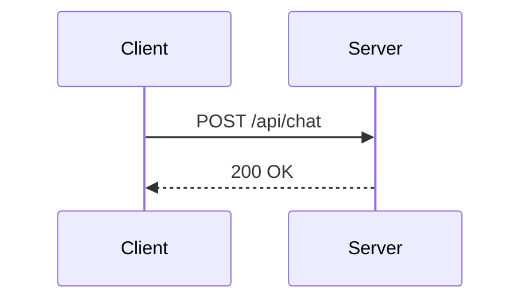

## Installation

```bash
npx @ravikumarsurya/mdx-ui add mermaid
```

## Usage

Pass the diagram source as `children` in manual MDX:

```jsx
<Mermaid>
  {`flowchart TD
    A[Start] --> B{Decision}
    B -->|Yes| C[Do it]
    B -->|No| D[Skip]`}
</Mermaid>
```

Or use the `chart` prop (emitted automatically by the remark plugin):

```jsx
<Mermaid chart={`sequenceDiagram\n  A->>B: Hello`} />
```

The component auto-detects the diagram type from the first line and shows a label badge (e.g. "Flowchart", "Sequence Diagram", "Gantt Chart").

## Remark plugin — auto-transform from markdown

When using `@ravikumarsurya/remark-mdx-ui`, fenced ` ```mermaid ` code blocks are automatically converted to `<Mermaid>` components. This is **on by default**.

````md

````

Renders as `<Mermaid chart={"sequenceDiagram\n  Client->>Server: ..."} />` — no manual wrapping needed.

To disable: `[remarkMdxUi, { mermaid: false }]`

## Per-type components

Named exports are available for each diagram type. They all delegate to `<Mermaid>` and display the appropriate label badge automatically:

```jsx
import {
  MermaidFlowchart,
  MermaidSequence,
  MermaidClass,
  MermaidState,
  MermaidER,
  MermaidGantt,
  MermaidPie,
  MermaidGitGraph,
  MermaidMindmap,
  MermaidTimeline,
} from "@/components/mdx/mermaid";
```

## Examples

### Flowchart

<Mermaid>{`flowchart TD
  A[User Request] --> B{Auth?}
  B -->|Yes| C[Process]
  B -->|No| D[401 Error]
  C --> E[Response]`}</Mermaid>

### Sequence Diagram

<Mermaid>{`sequenceDiagram
  Client->>Server: POST /api/chat
  Server->>AI: streamText()
  AI-->>Server: token stream
  Server-->>Client: SSE response`}</Mermaid>

### ER Diagram

<Mermaid>{`erDiagram
  USER ||--o{ ORDER : places
  ORDER ||--|{ LINE_ITEM : contains
  PRODUCT ||--o{ LINE_ITEM : listed_in`}</Mermaid>

### Gantt Chart

<Mermaid>{`gantt
  title Project Timeline
  dateFormat YYYY-MM-DD
  section Design
    Wireframes :done, 2024-01-01, 7d
    UI review  :active, 2024-01-08, 3d
  section Dev
    Frontend   :2024-01-11, 14d
    Backend    :2024-01-11, 10d`}</Mermaid>

## Data structure components

For algorithm and CS visualizations, use the dedicated data structure components. They accept typed data props, generate the mermaid diagram automatically, and show the correct label in the header.

### Binary Search Tree — `<MermaidBST>`

Pass an array of numbers. Values are inserted in order; duplicates are ignored.

```jsx
<MermaidBST values={[5, 3, 7, 1, 4, 6, 8]} />
```

<MermaidBST values={[5, 3, 7, 1, 4, 6, 8]} />

### Generic Tree — `<MermaidTree>`

Pass a nested `{ label, children }` structure.

```jsx
<MermaidTree
  data={{
    label: "root",
    children: [
      { label: "A", children: [{ label: "C" }, { label: "D" }] },
      { label: "B", children: [{ label: "E" }, { label: "F" }] },
    ],
  }}
/>
```

<MermaidTree
  data={{
    label: "root",
    children: [
      { label: "A", children: [{ label: "C" }, { label: "D" }] },
      { label: "B", children: [{ label: "E" }, { label: "F" }] },
    ],
  }}
/>

Use `direction="LR"` for a left-to-right layout.

### BFS Traversal — `<MermaidBFS>`

Nodes are annotated with their visit order (①②③…) in breadth-first order from `start`.

```jsx
<MermaidBFS
  nodes={["A", "B", "C", "D", "E", "F"]}
  edges={[
    ["A", "B"],
    ["A", "C"],
    ["B", "D"],
    ["B", "E"],
    ["C", "F"],
  ]}
  start="A"
/>
```

<MermaidBFS
  nodes={["A", "B", "C", "D", "E", "F"]}
  edges={[
    ["A", "B"],
    ["A", "C"],
    ["B", "D"],
    ["B", "E"],
    ["C", "F"],
  ]}
  start="A"
/>

### DFS Traversal — `<MermaidDFS>`

Same API as `<MermaidBFS>`, but numbers reflect depth-first visit order.

```jsx
<MermaidDFS
  nodes={["A", "B", "C", "D", "E", "F"]}
  edges={[
    ["A", "B"],
    ["A", "C"],
    ["B", "D"],
    ["B", "E"],
    ["C", "F"],
  ]}
  start="A"
/>
```

<MermaidDFS
  nodes={["A", "B", "C", "D", "E", "F"]}
  edges={[
    ["A", "B"],
    ["A", "C"],
    ["B", "D"],
    ["B", "E"],
    ["C", "F"],
  ]}
  start="A"
/>

## Props

### `<Mermaid>`

| Prop      | Type   | Default       | Description                                 |
| --------- | ------ | ------------- | ------------------------------------------- |
| children  | string | —             | Diagram source (manual MDX usage)           |
| chart     | string | —             | Diagram source (remark plugin / prop usage) |
| label     | string | auto-detected | Override the header label                   |
| className | string | —             | Additional CSS classes                      |

### `<MermaidBST>`

| Prop      | Type     | Default | Description                   |
| --------- | -------- | ------- | ----------------------------- |
| values    | number[] | —       | Values to insert into the BST |
| className | string   | —       | Additional CSS classes        |

### `<MermaidTree>`

| Prop      | Type             | Default | Description                                |
| --------- | ---------------- | ------- | ------------------------------------------ |
| data      | TreeNode         | —       | `{ label: string, children?: TreeNode[] }` |
| direction | `"TD"` \| `"LR"` | `"TD"`  | Layout direction                           |
| className | string           | —       | Additional CSS classes                     |

### `<MermaidBFS>` / `<MermaidDFS>`

| Prop      | Type               | Default | Description                 |
| --------- | ------------------ | ------- | --------------------------- |
| nodes     | string[]           | —       | All node names              |
| edges     | [string, string][] | —       | Edge pairs `[from, to]`     |
| start     | string             | —       | Starting node for traversal |
| directed  | boolean            | `false` | Treat edges as directed     |
| className | string             | —       | Additional CSS classes      |

## Supported diagram types (raw mermaid)

| First line keyword    | Detected as       | Label shown      |
| --------------------- | ----------------- | ---------------- |
| `flowchart` / `graph` | `flowchart`       | Flowchart        |
| `sequenceDiagram`     | `sequenceDiagram` | Sequence Diagram |
| `classDiagram`        | `classDiagram`    | Class Diagram    |
| `stateDiagram`        | `stateDiagram`    | State Diagram    |
| `erDiagram`           | `erDiagram`       | ER Diagram       |
| `gantt`               | `gantt`           | Gantt Chart      |
| `pie`                 | `pie`             | Pie Chart        |
| `gitGraph`            | `gitGraph`        | Git Graph        |
| `mindmap`             | `mindmap`         | Mind Map         |
| `timeline`            | `timeline`        | Timeline         |
