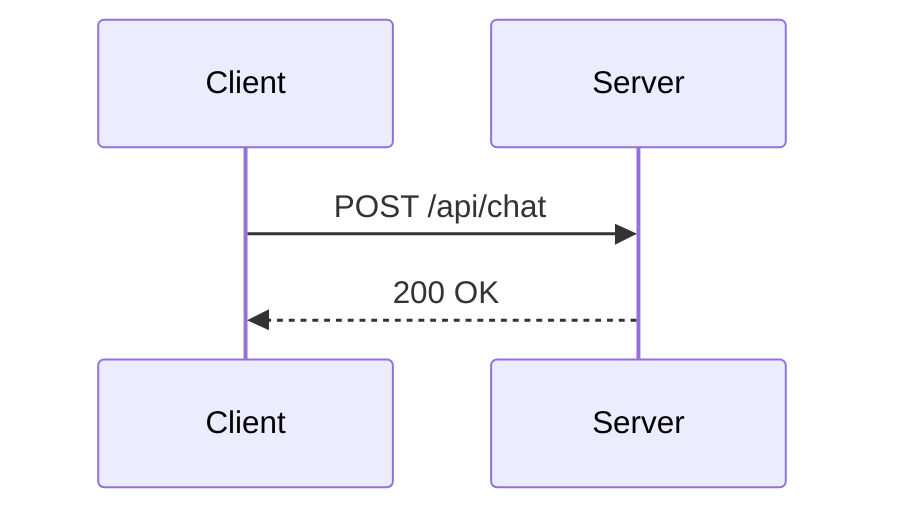

## Installation

```bash
npx @ravikumarsurya/mdx-ui add mermaid
```

## Usage

Pass the diagram source as `children` in manual MDX:

```jsx
<Mermaid>
  {`flowchart TD
    A[Start] --> B{Decision}
    B -->|Yes| C[Do it]
    B -->|No| D[Skip]`}
</Mermaid>
```

Or use the `chart` prop (emitted automatically by the remark plugin):

```jsx
<Mermaid chart={`sequenceDiagram\n  A->>B: Hello`} />
```

The component auto-detects the diagram type from the first line and shows a label badge (e.g. "Flowchart", "Sequence Diagram", "Gantt Chart").

## Remark plugin — auto-transform from markdown

When using `@ravikumarsurya/remark-mdx-ui`, fenced ` ```mermaid ` code blocks are automatically converted to `<Mermaid>` components. This is **on by default**.

````md

````

Renders as `<Mermaid chart={"sequenceDiagram\n  Client->>Server: ..."} />` — no manual wrapping needed.

To disable: `[remarkMdxUi, { mermaid: false }]`

## Per-type components

Named exports are available for each diagram type. They all delegate to `<Mermaid>` and display the appropriate label badge automatically:

```jsx
import {
  MermaidFlowchart,
  MermaidSequence,
  MermaidClass,
  MermaidState,
  MermaidER,
  MermaidGantt,
  MermaidPie,
  MermaidGitGraph,
  MermaidMindmap,
  MermaidTimeline,
} from "@/components/mdx/mermaid"
```

## Examples

### Flowchart

<Mermaid>{`flowchart TD
  A[User Request] --> B{Auth?}
  B -->|Yes| C[Process]
  B -->|No| D[401 Error]
  C --> E[Response]`}</Mermaid>

### Sequence Diagram

<Mermaid>{`sequenceDiagram
  Client->>Server: POST /api/chat
  Server->>AI: streamText()
  AI-->>Server: token stream
  Server-->>Client: SSE response`}</Mermaid>

### ER Diagram

<Mermaid>{`erDiagram
  USER ||--o{ ORDER : places
  ORDER ||--|{ LINE_ITEM : contains
  PRODUCT ||--o{ LINE_ITEM : listed_in`}</Mermaid>

### Gantt Chart

<Mermaid>{`gantt
  title Project Timeline
  dateFormat YYYY-MM-DD
  section Design
    Wireframes :done, 2024-01-01, 7d
    UI review  :active, 2024-01-08, 3d
  section Dev
    Frontend   :2024-01-11, 14d
    Backend    :2024-01-11, 10d`}</Mermaid>

## Props

| Prop | Type | Default | Description |
|------|------|---------|-------------|
| children | string | — | Diagram source (manual MDX usage) |
| chart | string | — | Diagram source (remark plugin / prop usage) |
| className | string | — | Additional CSS classes |

## Supported diagram types

| First line keyword | Detected as | Label shown |
|--------------------|-------------|-------------|
| `flowchart` / `graph` | `flowchart` | Flowchart |
| `sequenceDiagram` | `sequenceDiagram` | Sequence Diagram |
| `classDiagram` | `classDiagram` | Class Diagram |
| `stateDiagram` | `stateDiagram` | State Diagram |
| `erDiagram` | `erDiagram` | ER Diagram |
| `gantt` | `gantt` | Gantt Chart |
| `pie` | `pie` | Pie Chart |
| `gitGraph` | `gitGraph` | Git Graph |
| `mindmap` | `mindmap` | Mind Map |
| `timeline` | `timeline` | Timeline |
